# Expense Tracker Mobile App - App Flows Document

## 1. Authentication Flow

### 1.1 Initial App Launch
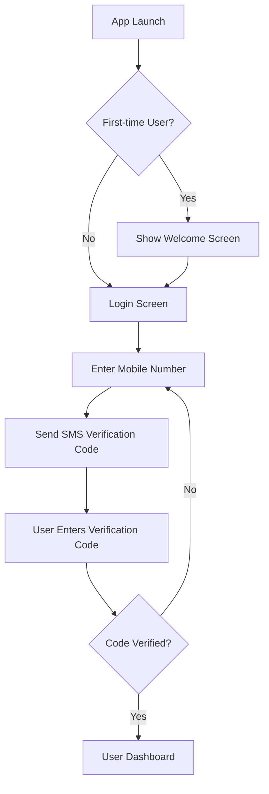

### 1.2 User Profile Creation Flow
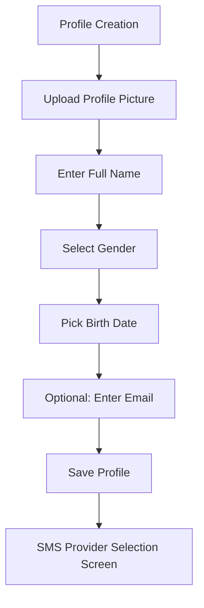

## 2. SMS Integration Flow

### 2.1 SMS Provider Selection
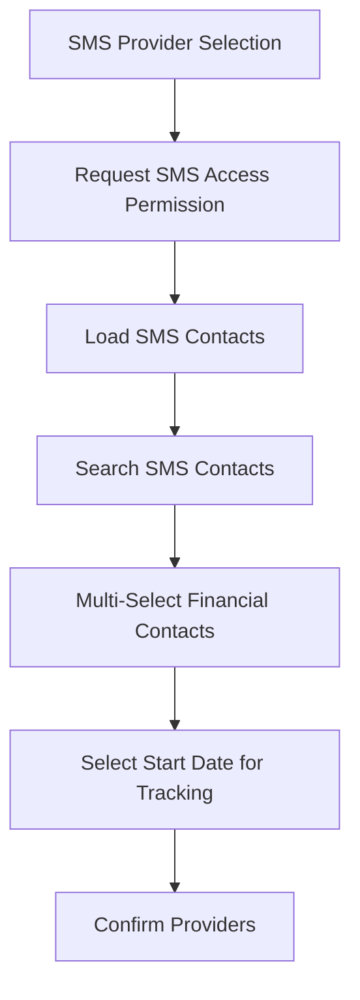

### 2.2 Transaction Extraction - New Messages
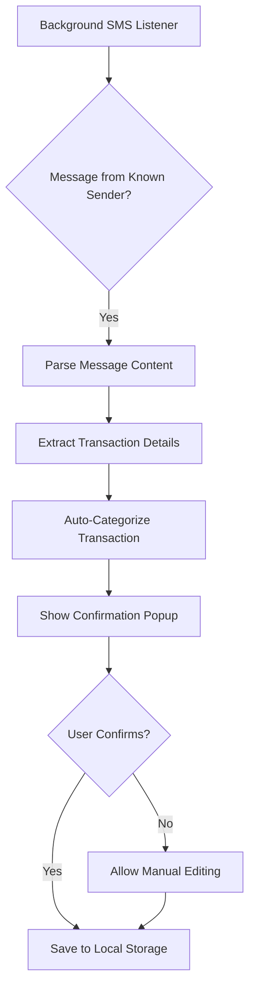

### 2.3 Historical Message Processing
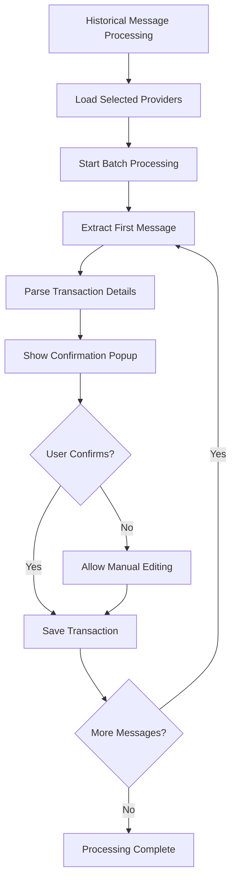

## 3. Ad-hoc Entry Flow
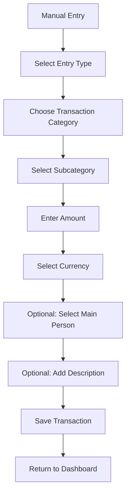

## 4. Reporting and Dashboard Flow

### 4.1 Default Dashboard
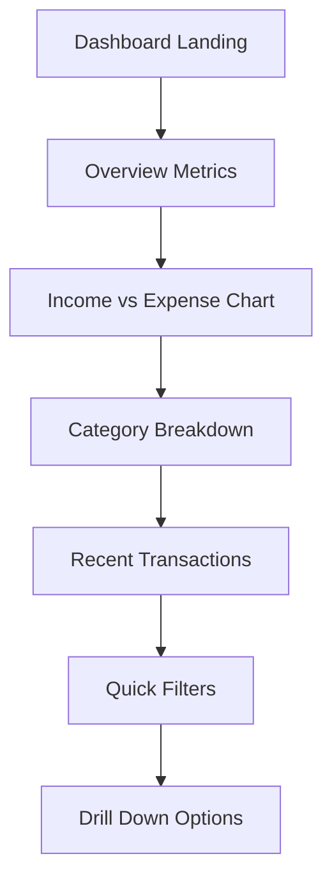

### 4.2 Custom Dashboard Builder
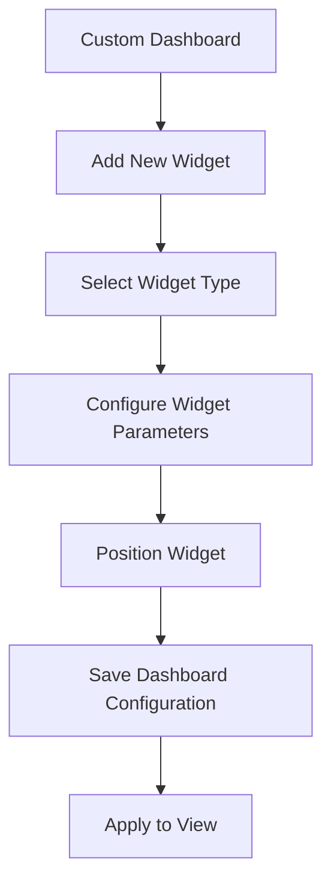

## 5. Error Handling Flows

### 5.1 SMS Permission Denied
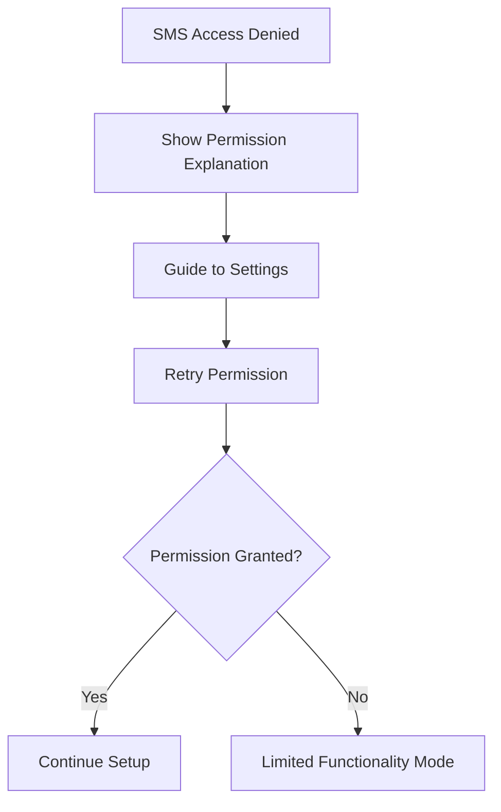

### 5.2 Transaction Parsing Failure
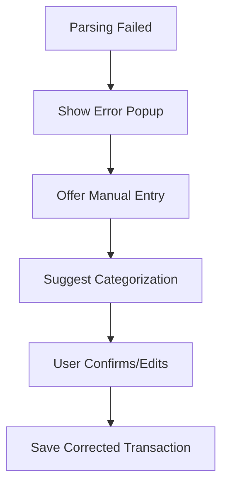

## 6. Settings and Profile Management
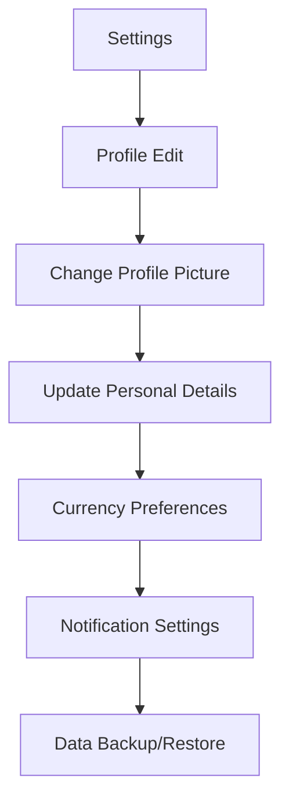

## Appendix: Key User Journeys
1. New User Onboarding
2. Existing User Login
3. SMS Transaction Tracking
4. Manual Transaction Entry
5. Reporting and Analytics
6. Profile and Settings Management

## Recommendations for Implementation
- Implement robust error handling
- Ensure smooth user experience during SMS parsing
- Provide clear guidance and tooltips
- Design intuitive navigation between flows
