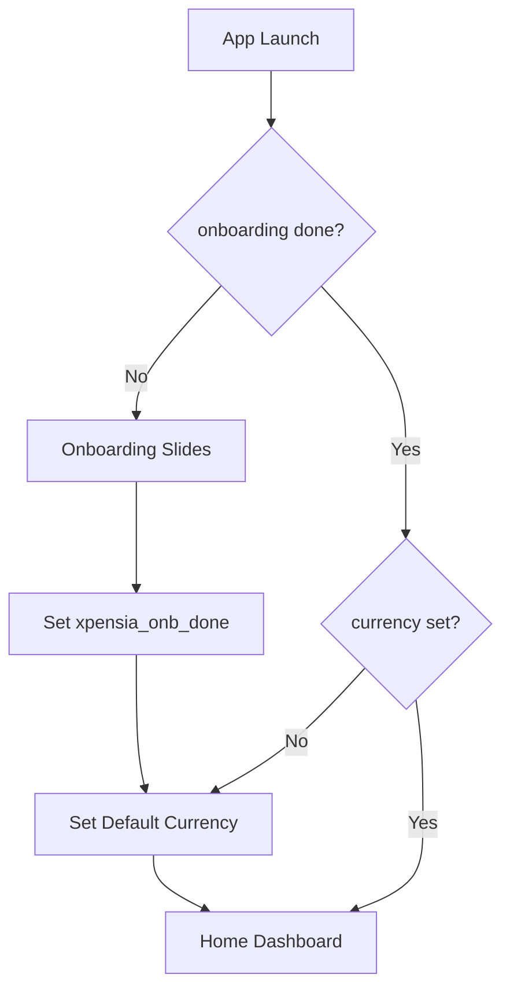
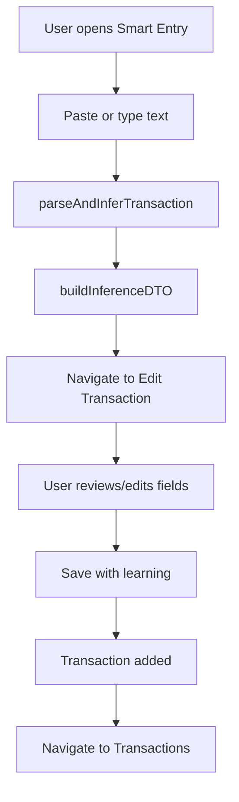
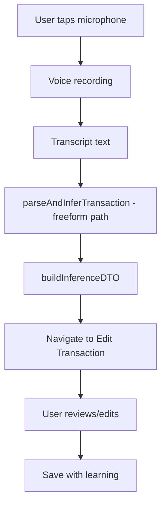
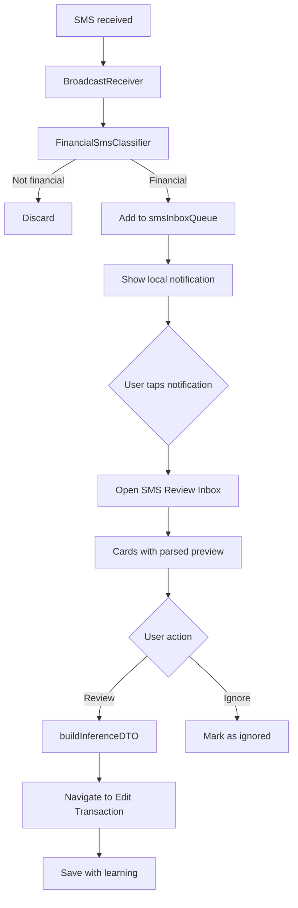
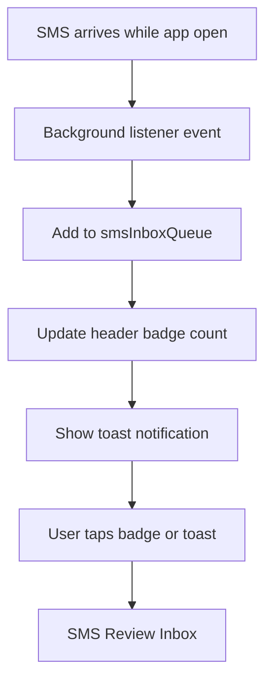
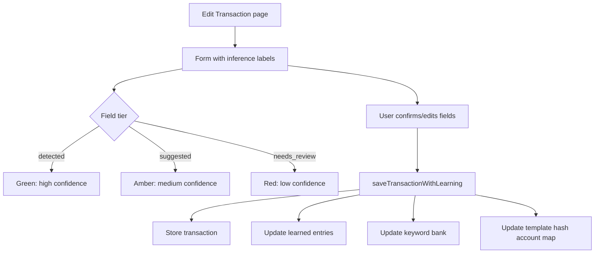
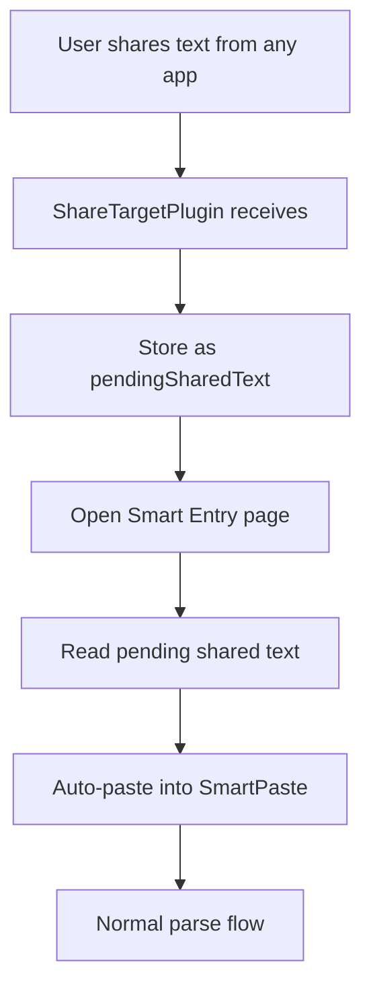

# Xpensia — UX Screens & Flows

> **Status**: Living document — reflects current implemented navigation and workflows  
> **Last synced with codebase**: 2026-03-11

---

## 1. Navigation Model

### Bottom Navigation (4 items)
| Icon | Label | Route |
|---|---|---|
| Home | Home | `/home` |
| Upload | Smart Entry | `/import-transactions` |
| List | Transactions | `/transactions` |
| PieChart | Analytics | `/analytics` |

### Header Bar
- **Left**: Back button (on sub-pages) or hamburger menu
- **Center**: Page title (translated)
- **Right**: SMS inbox icon with pending count badge

### Drawer Menu (hamburger)
| Item | Route | Notes |
|---|---|---|
| Home | `/home` | |
| Smart Entry | `/import-transactions` | |
| Transactions | `/transactions` | |
| Analytics | `/analytics` | |
| Budget | `/budget` | |
| SMS Review | `/sms-review` | Mobile only |
| Exchange Rates | `/exchange-rates` | |
| Settings | `/settings` | |
| Feedback | `__feedback__` | Mobile only, opens email |
| Profile | `/profile` | |
| About | `/about` | Mobile only |

---

## 2. Information Architecture

```
App
├── Onboarding (first launch only)
│   ├── Slide 1: Welcome
│   ├── Slide 2: Features
│   ├── Slide 3: Get started
│   └── → Set Default Currency → Home
├── Home Dashboard
│   ├── Stats cards (income/expense/balance)
│   ├── Charts (category, timeline, net balance)
│   ├── Recent transactions
│   └── FAB → Smart Entry
├── Smart Entry (/import-transactions)
│   ├── SmartPaste component (paste/type/voice)
│   ├── SMS Inbox section (pending items)
│   └── → Edit Transaction
├── SMS Review Inbox (/sms-review)
│   ├── Pending SMS cards with parsed preview
│   ├── Review → Edit Transaction
│   └── Ignore → dismiss
├── Edit Transaction (/edit-transaction)
│   ├── Form with detected/suggested field labels
│   ├── Save with learning
│   └── → Transactions list
├── Transactions (/transactions)
│   ├── Date/type filters
│   ├── Search
│   ├── Edit dialog
│   └── FAB → Smart Entry
├── Analytics (/analytics)
│   ├── Period selector
│   ├── Category breakdown
│   ├── Subcategory drill-down
│   ├── Timeline chart
│   └── Net balance chart
├── Budget (/budget)
│   ├── Budget hub (list)
│   ├── Budget detail
│   ├── Set budget
│   ├── Budget report
│   ├── Budget insights
│   └── Accounts
├── Exchange Rates (/exchange-rates)
├── Settings (/settings)
│   ├── Theme toggle
│   ├── Currency selection
│   ├── Week start day
│   ├── SMS permissions
│   ├── Background SMS toggle
│   ├── Import/Export (CSV/JSON)
│   ├── Data reset
│   └── OTA update check
├── Profile (/profile)
│   ├── Name/email edit
│   ├── Avatar (camera)
│   └── Auth status
└── About (/about)
```

---

## 3. Key Workflow Diagrams

### 3.1 Onboarding Flow



### 3.2 Smart Entry — Manual Paste/Type Flow



### 3.3 Smart Entry — Voice/Freeform Flow



### 3.4 SMS Notification → Review → Save Flow



### 3.5 SMS Foreground Flow



### 3.6 Transaction Edit & Save with Learning



### 3.7 Share Sheet Intake (Android)



---

## 4. Page Entry Points Summary

| Page | Entry Points |
|---|---|
| Onboarding | First launch, `xpensia_onb_done` not set |
| Home | Bottom nav, drawer, post-onboarding, app open |
| Smart Entry | Bottom nav, drawer, FAB, share sheet, notification |
| SMS Review Inbox | Header badge, drawer, notification tap |
| Edit Transaction | Smart Entry parse, SMS Review, transaction list edit |
| Transactions | Bottom nav, drawer, post-save redirect |
| Analytics | Bottom nav, drawer |
| Budget | Drawer |
| Settings | Drawer |
| Profile | Drawer |
